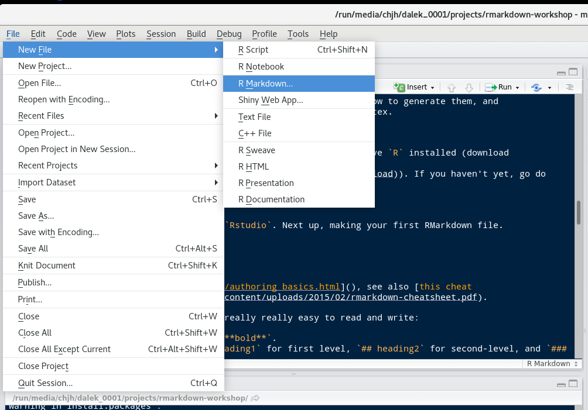
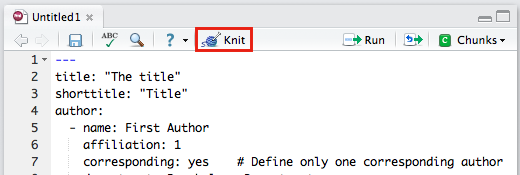

```{r, echo=FALSE}
library(knitr)
opts_chunk$set(echo=TRUE, 
               warning=FALSE, message=FALSE, 
               cache=FALSE)
```

This document is adapted from a previous tutorial developed by [Mike Frank](mailto:mcfrank@stanford.edu) & [Chris Hartgerink](mailto:chris@libscie.org) which can be found [here](https://github.com/mcfrank/rmarkdown-workshop).

# Introduction

This short tutorial explains some of the key elements involved in writing a transparent and reproducible scientific paper. The tutorial assumes you already know some basic `R` programming.

We will use the following tools:

* R (and specifically, R Studio, R Markdown, and the tidyverse, knitr, and papaja packages)
* [Open Science Framework](https://osf.io/)
* [Github](https://github.com/)

## Learning goals

By the end of this class you should have a basic understanding of the following elements of a transparent and reproducible scientific paper:

* **Co-piloting** and the potential benefits of pairing up to minimize human error
* **Open Science** by sharing files on the Open Science Framework
* **Version control** using Github
* **Dynamic report generation** using R Markdown and knitr
* **Data documentation** by making data 'Tidy' and making a codebook
* **Literate programming** using R Markdown
* **Journal templates** using papaja
* **Sofware containers** using Code Ocean

# Getting Started

## Installation

Before we get started please make sure to install the following:

* `R` (download [here](https://cran.r-project.org/))
* `RStudio` (download [here](https://www.rstudio.com/products/rstudio/download/#download)). 
* A TeX distribution (e.g., [MikTeX](http://miktex.org/) for Windows, [MacTeX](https://tug.org/mactex/) for Mac, or [TeX Live](http://www.tug.org/texlive/) for Linux).
* install the tidyverse, knitr, and papaja packages:

```{r eval=FALSE}
# Install tidyverse package
install.packages('tidyverse')

# Install knitr package
install.packages('knitr')

# Install devtools package if necessary
if(!"devtools" %in% rownames(installed.packages())) install.packages("devtools")

# Install papaja package
devtools::install_github("crsh/papaja")
```

```{r echo = FALSE}
# Load all the packages we need:
library(tidyverse)
library(knitr)
library(papaja)
```

**When you're done, put up a green/yellow post-it. If you get stuck, put up a pink/red post-it**

# Exercise: Open Science Framework, Github, and RStudio

* Go to https://osf.io/ and create an account (or sign in).
* Go to https://osf.io/dashboard and click on "create new project". Enter a title for your project e.g., "Reproducibility class exercise" (or something more exciting). Add your copilot as a collaborator. Create a component called 'data' and a component called 'analysis'.
* Fork [the repo](https://github.com/TomHardwicke/reproducible-paper-tutorial) and clone it to your computer.
* Open up R Studio. Create a new project that points to the repo you downloaded.

**When you're done, put up a green/yellow post-it. If you get stuck, put up a pink/red post-it**

## Exercise: Dynamic report generation with R Markdown and knitr

Next up, making your first R Markdown file.

Fire up R Studio and create a new R Markdown file. Don't worry about the settings for now.

```{r, echo = FALSE}

```

Before we go any further, save the file (via the menu, 'file', then 'save'). Choose any name you wish.

When you first create an R Markdown file it contains some example content. Let's go ahead and generate a report right away so you get an idea of what the end product looks like.

If you click on "Knit" the RMarkdown file will run, generate all results, and present you with a HTML file, PDF file, or a Word file. If RStudio requests you to install packages, click yes and see whether everything works to begin with. 

A window should appear containing the report and you should be able to find the corresponding file in your repo folder. Try changing some things in the R markdown file then rekniting to see the changes in the final report. For example, change the title of the report from 'untitled' to whatever you wish.

You could also try generating your report in a different format. If you've just created a html report, you could now try creating a pdf report^[Note: to create PDF documents you also need a TeX installation]. You can do this in a couple of ways. One way is to change `html_document` to `pdf_document` at the top of the R Markdown file where it says 'output'. Alternatively, click on the small black arrow next to the knit button and click 'Knit to pdf'.

**When you're done, put up a green/yellow post-it. If you get stuck, put up a pink/red post-it**

# A made-up study about bananas

To get a better idea of how all of this works you are going to create a simple reproducible analysis for a made up experiment. *You might first want to remove the example content from the R Markdown file - but make sure you keep the header and the first code chunk called 'setup'.*

Ok here's a made up study for us to play with. Imagine that you are the manufacturer of an energy bar marketed at runners. You hypothesize that including mashed up banana in the bar will provide more energy and make runners run faster. You go to a major althetics tournament which is being attended by 10 400m runners. Each runner is running in two 400m events. Before each 400m event, you give each runner an energy bar to eat. For one run, they eat a version of the energy bar containing mashed banana and for the other run they eat a version of the energy bar that contains no banana^[You don't need to worry about this but assume that appropriate counter-balancing is employed so 5 runners get the energy bar with banana for the their first run and without banana for their second run whilst the other 5 runs have the opposite order.]. You predict that after eating the banana version runners will complete the race more quickly than after eating the no banana version.

# Exercise: Tidy data and codebooks

To get started, we will load the data file, make the data 'Tidy', and provide some documentation.

1. First load the data file (bananaData.csv) which was in the repo you downloaded. 

```{r echo = FALSE}
d <- read_csv('bananaData.csv')
```

2. Is the data understandable? Discuss with your co-pilot why it might be difficult for an independent researcher to reuse this dataset and write down issues that need to be addressed. When you're ready, click on the arrow below to reveal the issues.

<details><summary>Solution: What is wrong with the data file?</summary>
<p>
* Firstly, 'pid' presumably means 'participant identification number' but we could make that clearer
* The gender column contains the numbers 1 and 2 but we do not know which is male and which is female. Let's say that 1 = male and 2 = female.
* In the condition column we have conditionA and conditionB but it doesn't say how these map on to the banana and no banana conditions! Let's say that A = banana and B = no banana
* The units for the numbers for the measured variable in each condition are not listed. Let's say that these are seconds.
* Likewise for age, presumably this is years of age, but we should be explicit about that.

</p>
</details>

Two options for improving the understandability of the data file are to (1) make changes to the data file itself; (2) provide a codebook which explains how the data are organised. Let's do a combination of both. First rename conditionA column to 'noBanana' and the conditionB column to 'banana'.

```{r echo = FALSE}
d <- d %>% rename(banana = conditionA, noBanana = conditionB)
```

Your dataframe should now look like this:

```{r}
kable(head(d))
```

Now open the file codebook_bananaData.txt. This is a very simple 'codebook' - a document that describes the content and organisation of the data file. Fill in the remainder of the codebook. Make sure you address all of the issues outlined above. For example, you need to explain what '1' and '2' refer to in the gender column.

3. Is the data in Tidy format? If not, make the data tidy. Remember the rule of Tidy data is 'variables in columns, observations in rows'.

```{r echo = FALSE}
d <- gather(d, condition, runTime, noBanana:banana, factor_key=TRUE)
```

When you have the data Tidy, it should be structured like this:

```{r}
kable(head(d))
```

Now let's save the data as "data_tidy.csv":

```{r}
write_csv(d, 'data_tidy.csv')
```

Now see if you can find the file you just created on your computer - it should be in the repo folder you downloaded earlier...

Great! We now have a well organised data set with documentation to help other researchers, or your future self, understand what the data mean. This should help others to re-use the data.

**When you're done, put up a green/yellow post-it. If you get stuck, put up a pink/red post-it**

# Demo: Literate programming with R Markdown

## Graphs

It's really easy to include graphs, like this one. (Using the `mtcars` dataset that comes with `ggplot2`).

```{r}
qplot(hp, mpg, col = factor(cyl), data = mtcars)
```

All you have to do is make the plot and it will render straight into the text. 

External graphics can also be included, as follows:

```{r eval = FALSE}
knitr::include_graphics("path/to/file")
```

In the repo you downloaded, you will see there is a folder called 'img' (a common short-hand for "images") which contains an image called "bananas". Let's modify the code shown above to display the bananas in the report.

```{r}
knitr::include_graphics("img/bananas.jpg")
```

## Tables

There are many ways to make good-looking tables using RMarkdown, depending on your display purpose. The `knitr` package comes with the `kable` function. It's versatile and makes perfectly reasonable tables. It also has a `digits` argument for controlling rounding. 

```{r}
kable(head(mtcars), digits = 1)
```

## Statistics

It's also really easy to include statistical tests of various types. 

For this, an option is the `broom` package, which formats the outputs of various tests really nicely. Paired with knitr's `kable` you can make very simple tables in just a few lines of code. 

```{r}
mod <- lm(mpg ~ hp + cyl, data = mtcars)
kable(broom::tidy(mod), digits = 3)
```

Of course, cleaning these up can take some work. For example, we'd need to rename a bunch of fields to make this table have the labels we wanted (e.g., to turn `hp` into `Horsepower`). 

We often need APA-formatted statistics. We can compute them first inside a code chunk, and then print them inline. For example:

```{r}
ts <- with(mtcars,t.test(hp[cyl==4], hp[cyl==6]))
```

> There's a statistically-significant difference in horsepower for 4- and 6-cylinder cars  ($t(`r round(ts$parameter,2)`) = `r round(ts$statistic,2)`$, $p = `r round(ts$p.value,3)`$). 

To insert these stats inline I wrote `round(ts$parameter, 2)` inside an inline code block.

# Exercise: Literate programming with R Markdown

Ok let's practice your R Markdown skills!

Firstly make a summary table of the banana study data. The table should show the mean and standard deviation in each condition. In which condition were the runners slower to complete the 400m track? Does this seem to fit with our prediction?

<details><summary>Solution</summary>

```{r}
d %>% 
  group_by(condition) %>% 
  summarise(M = mean(runTime), SD = sd(runTime)) %>%
  kable(digits = 2)
```

When the energy bars contained mashed banana the runners seemed to be much faster!

</details>

Instead of a table, we could make a graph. Make a simple graph to display the results.

<details><summary>Solution</summary>

For the purposes of this exercise, let's just make a very simple boxplot to display the data. You might want to explore the `ggplot` package at some point which offers powerful graphing tools.

```{r}
boxplot(runTime  ~ condition, data = d)
```

</details>

Terrific. Finally, let's run a statistical test and display the output directly in the text of our report. Run a repeated-measures t-test comparing the banana and no banana conditions and report the outcome directly in the text.

<details><summary>Solution</summary>

To run a t-test we use the `t.test()` function. There are several ways to insert the data into the function, but the most understandable way is to create two vectors containing the running times for each condition, and enter these separately as the arguments x and y. We will use the `filter` and `pull` functions to extract the data we need.

```{r}
noBanana <- d %>% filter(condition == 'noBanana') %>% pull(runTime)
banana <- d %>% filter(condition == 'banana') %>% pull(runTime)
```

Now run the t-test. Remember we need to tell the `t.test` function that this is paired data. We will save the output of the test as `t.out` so we can use it directly in the text.

```{r}
t.out <- t.test(x = noBanana, y = banana, paired = TRUE)
```

To report the outcome of the test in the text, we can refer to parts of the t.out object directly. We can also use the `apa_print` function provided with the papaja package which extracts the key information we need. Below I am using the following code `apa_print(t.out)$statistic`:

A repeated-measures t-test indicated that there was a statistically significant difference between the banana and no banana conditions, `r apa_print(t.out)$statistic`.
</details>

**When you're done, put up a green/yellow post-it. If you get stuck, put up a pink/red post-it**

# Exercise: Using the papaja journal template

The end-game of reproducible research is to knit your entire paper. We'll focus on APA-style writeups. Managing APA format is a pain in the best of times. Isn't it nice to get it done for you? 

[Frederick Aust](http://github.com/crsh)^[Frederick contributed to previous versions of this part of the tutorial.] has created an R package called `papaja`. `papaja` is a R-package including a R Markdown template that can be used to produce documents that adhere to the American Psychological Association (APA) manuscript guidelines (6th Edition). These documents are immediatey ready for submission to a preprint server or journal.

If everything installed correctly earlier, then The APA manuscript template should now be available through the RStudio menus when creating a new R Markdown file.

```{r template-selection, echo = FALSE, fig.cap = "papaja's APA6 template is available through the RStudio menues."}
knitr::include_graphics("figures/template_selection.png")
```

Create a new R Markdown file using this template and save it as 'paper'. Note that the template already comes with some sample content to get us started. When you click RStudio's *Knit* button `papaja`, `rmarkdown,` and `knitr` work together to create an APA formatted manuscript that includes both your manuscript text and the results of any embedded R code.

```{r knit-button, echo = FALSE, fig.cap = "The *Knit* button in the RStudio."}

```

Note, if you don't have TeX installed on your computer, or if you would like to create a Word document replace `output: papaja::apa6_pdf` with `output: papaja::apa6_word` in the document YAML header.

`papaja` provides some rendering options that only work if you use `output: papaja::apa6_pdf`.
`figsintext` indicates whether figures and tables should be included at the end of the document---as required by APA guidelines---or rendered in the body of the document.
If `figurelist`, `tablelist`, or `footnotelist` are set to `yes` a list of figure captions, table captions, or footnotes is given following the reference section.
`lineno` indicates whether lines should be continuously numbered through out the manuscript.

Try moving over some of the code chunks from your other R Markdown file where you did some preliminary analysis of the banana study data. You can also change some things in the header section - for example, add the name of you and your copilot and your institutional affiliations. Perhaps add a title and short abstract. Now reknit the document...

Pretty groovy.

**When you're done, put up a green/yellow post-it. If you get stuck, put up a pink/red post-it**


# Demo: More Papaja

## Cross-referencing

`papaja` has all kinds of neat features that we would expect in a scientific paper. For example, you can add cross-references to particular sections or figures. Generally, a cross-reference to a figure, table, or document section can be done by using the syntax `\@ref(label)`.

If you set a figure caption in a code chunk via the chunk option `fig.cap = "This is my figure caption."`, the label for that figure is based on the label of the code chunk, e.g., if the chunk label is `foo`, the figure label will be `fig:foo`.

If you used `knitr::kable()` or `apa_table()` to create a table, the label for that table is, again, based on the label of the code chunk, e.g., if the chunk label is `foo`, the figure label will be `tab:foo`

For more details see this [documentation](https://bookdown.org/yihui/bookdown/cross-references.html).

## Bibiographic management

It's also possible to include citations using `bibtex`, by using `@ref` syntax. 

It helps if you are using reference management software, such as [Zotero](https://www.zotero.org/) or [bibdesk](http://bibdesk.sourceforge.net/). From these programs you can generate something called a `bibtex` file contains all of the references you need.

With a bibtex file included, you can refer to papers. As an example, `@nuijten2016` results in the in text citation "@nuijten2016". You can also cite parenthetically with `[@nuijten2016]` [@nuijten2016]. 

Eventually your will probably want to start using `citr` - an easy-to-use [RStudio addin](https://rstudio.github.io/rstudioaddins/) that facilitates inserting citations.
The addin will automatically look up the Bib(La)TeX-file(s) specified in the YAML front matter.
The references for the inserted citations are automatically added to the documents reference section.

<!-- # ```{r citr-gif, echo = FALSE, fig.align = "center", fig.cap = "Demonstration of the RStudio addin from the `citr` package that inserts R Markdown citations."} -->
<!-- # knitr::include_graphics("figures/addin_demo.gif") -->
<!-- # ``` -->

Once `citr` is installed (`install.packages("citr")`) and you have restarted your R session, the addin appears in the menus and you can define a [keyboard shortcut](https://rstudio.github.io/rstudioaddins/#keyboard-shorcuts) to call the addin.

# Exercise: Open Science Framework revisted

You've now mastered the basics of writing a reproducible scientific paper! We should now make all of this openly available so that others can verify the reproducibility of the paper and re-use the data. For this exercise, upload the research artifacts you have created to your OSF project. I'd recommend creating a separate component for each artifact. For example, the 'data' component should contain the data file and the codebook. The 'analysis' component should contain the R markdown file.

# Demo: The finished product - Open Science Framework, preprints, and software containers

We will now take a brief tour of a published project that demonstrates a transparent and reproducible scientific paper. We'll also explore two additional concepts here: pre-prints and software containers.

* [OSF project](https://osf.io/wn8fd/)
* [Code Ocean page](https://doi.org/10.24433/CO.abd8b483-c5e3-4382-a493-1fc5aecb0f1d.v2)
